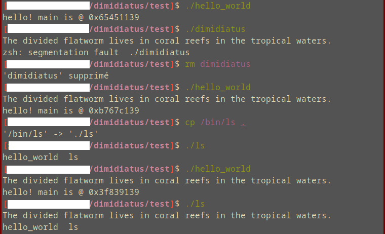

# 🪱 dimidiatus

A simple, proof-of-concept, 536-bytes long, ELF64 self-replicating worm written in assembly.

## How to use

```shell
make
./dimidiatus
```

## Behaviour

The current payload simply outputs the signature, then proceeds to infect all files in the current directory.

The infection method is pretty simple: the program searches for a `PT_LOAD` program header that is executable and contains enough empty space at its end to load our very own code. The target program's entry point is then modified to point towards our worm.

## Example usage

I have moved the `dimidiatus` and `hello_world` executables in a folder named `test`.
The segmentation fault happens only during patient-zero infection as there is no entry point to jump back to.

